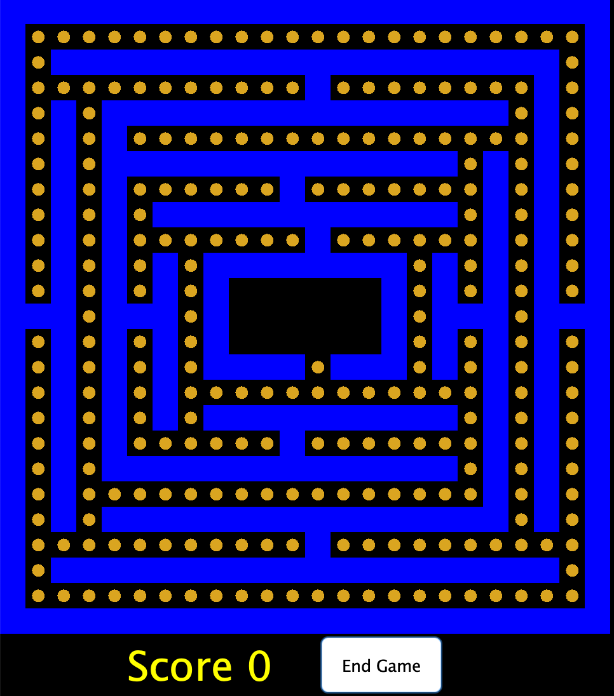

# Pacman Simulator
Sophie Jorgensen, Suraj Narang, Sahil Sinha, Ge Huang

## Running the code
To run the code, navigate to the P3/ directory and run the following commands:

```bash
javac -cp "src/" src/*.java
java -cp "src/" StartMenu
```

From here, a GUI should pop up where you can select "Start Game"

## Display of Running PacMan


# Functions

## PacMan Class
1. move(): This method controls PacMan's moves. It gets all the possible moves by calling get_valid_moves() and uses the first Location in the list if it is valid, moving the PacMan. It returns true if the PacMan moves and false if not.

To test this, I created a PacMan at coordinates (1,1) and initialized the board to have no ghosts. Because get_valid_moves could move the PacMan up or to the right (assuming walls are on other corners), I checked if the PacMan's location is now (1,2) or (2,1). 

2. is_ghost_in_range(): This method checks where a ghost is 1 spot away from the current location of the pacman character

To test this this function, I checked every possible spot that is 1 spot away and checked whether a ghost character is located there

3. consume(): This method determines whether the cookie is actually consumed after being eaten. The method returns null if the component is not consumed.

To test this function, I set a location for pacman and made all players to begin the game. Then, I tested if the cookie existed in that location and once the consume function is called, check whether the cookie is consumed.

4. get_valid_moves(): This method returns all the valid moves that PacMan can make given his current position. It can move 1 unit up/down/left/right if there isn't a wall/ghost at that position.

To test this function, I created a PacMan at coordinates (1,1) and initialized the board to have no ghosts. The function should return an arraylist contains (2,1) and (1,2) because there are walls at (0,1) and (1,0). 


## Ghost Class
1. attack(): This method has the Ghost attack PacMan if the PacMan is in range of the ghost, and calls Map's attack() method if so. It returns true for a successful attack and false for not.

To test this, I created PacMan and Ghost characters that are adjacent on the board, and checked to ensure the ghost's attack() method successfully executed and returned true.

2. is_pacman_in_range(): This method checks where the pacman is 1 spot away from the current location of the ghost character

To test this this function, I checked every possible spot that is 1 spot away and checked whether a pacman character is located there

3. move(): This method verifies whether the expected location to be moved towards is a valid movement and if the end location does not consist of a barrier. 

To test this, I created a Ghost on the board and asserts whether the players' locations landed on a valid spot based on several possible movements.

4. get_valid_moves(): This function returns an arraylist of possible locations that a ghost can move to from its current location. It can move 1 unit up/down/left/right if there isn't a wall at that position.

To test this function, I created a Ghost at coordinates (1,1) and initialized the board. The function should return an arraylist contains (2,1) and (1,2) because there are walls at (0,1) and (1,0). 

## Map Class
1. attack(): This method updates the game to be over if the Ghost attacked PacMan, returning true if so.

To test this, I called the ghost's attack() method, which relies on map's attack() method. Thus, I ensured that the ghost's attack() return type was true, and that the isGameOver() method returned true after PacMan was attacked.

2. eatCookie(): this function keeps track of the cookies on the map. This function is used to update the GUI display when a cookie is eaten

To test this function, I create a new locatoin and a pacman character. Then I check whether if a blank map returns null when eatCookie() is used

3. getLoc(): This method simply retrieves the icon given the location that it is currently presently at

To test this, I set ghost and pacman locations respectively, and checked if one location consisted of the ghost and not pacman, and vice-versa

4. move(): The method takes a name, location, and type and put the object specified by the name at the location. It updates locations, components, and field of the object when the name exists and returns true, otherwise it returns false.

To test this, I created a PacMan at coordinates (1,1) and initialized the board to have no ghosts. I then moved it to (1,2). I checked whether move() returns true and and used getLoc() to check whether the the object currently at (1,2) is PacMan.
